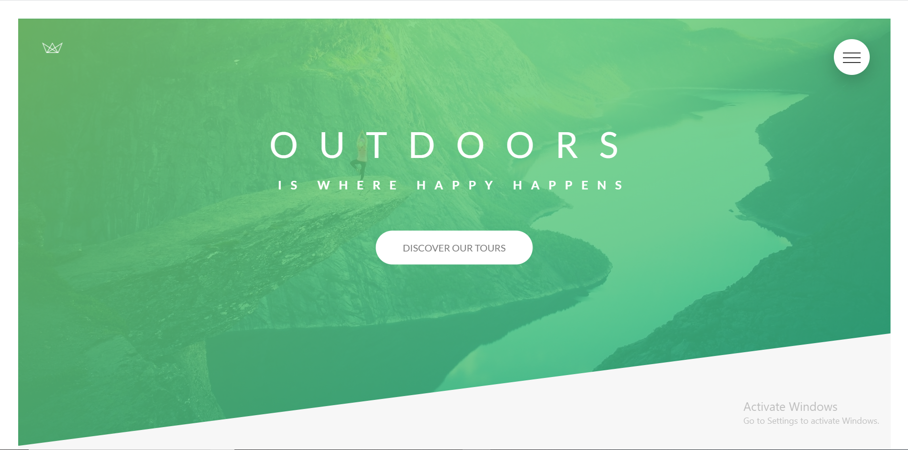
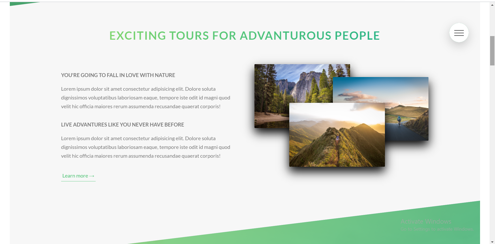
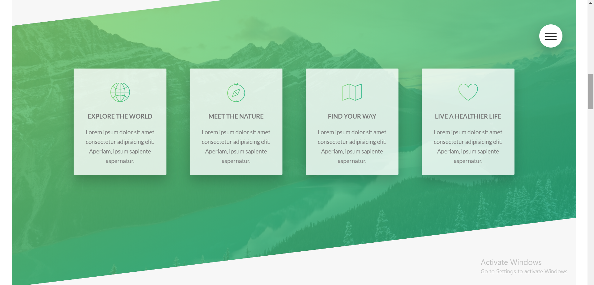
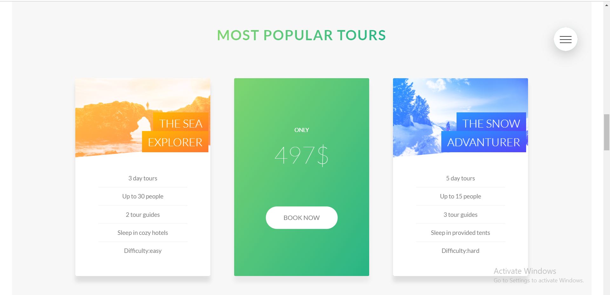
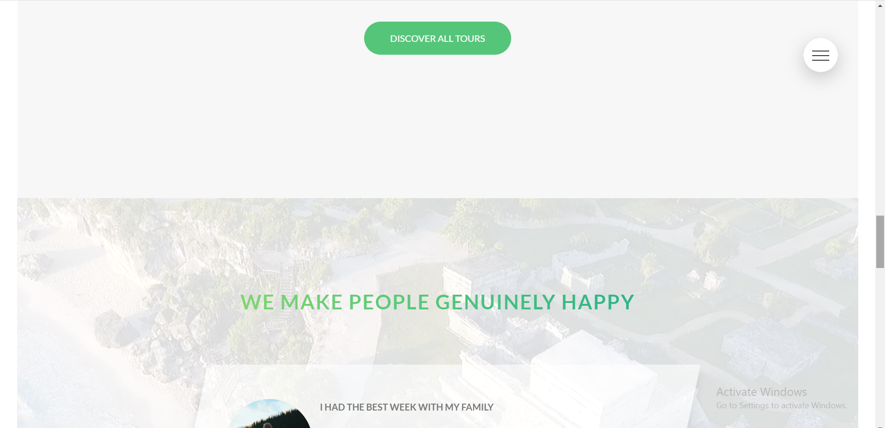
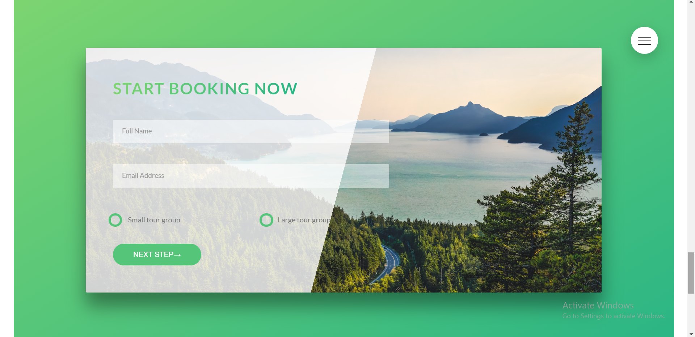
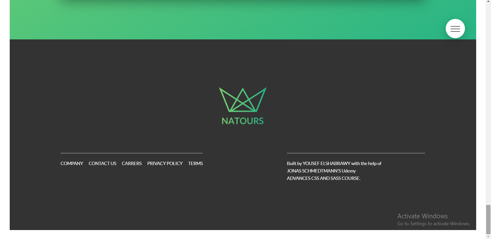

# Natours

Natours is a responsive website for a fictional company that offers tours in the nature. It's one of the projects of The Advanced CSS and SASS Course on Udemy taught by Jonas Schmedtmann.

## 💻 Build with

- HTML5
- Advanced CSS3
- SCSS

## 📷 Screen Shots

